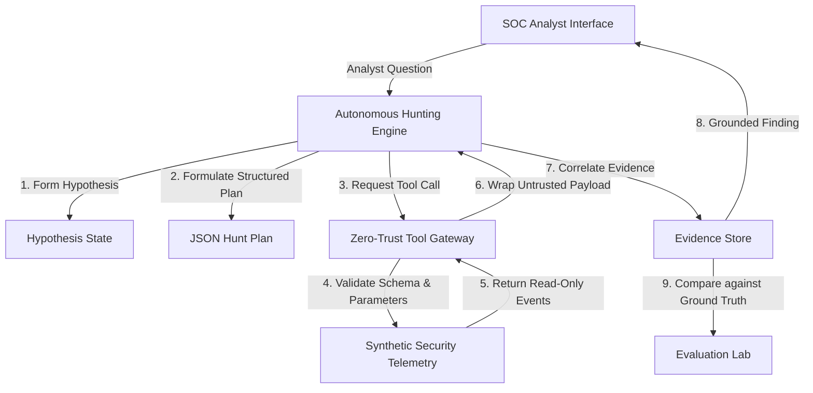

# Autonomous Threat-Hunting Copilot

> An AI-Assisted, Zero-Trust Threat-Hunting Workstation & Controlled Autonomous Investigation Engine for SOC Analysts.

---

## 🛡️ Executive Summary

The **Autonomous Threat-Hunting Copilot** is a security-first investigation workstation designed to assist SOC analysts in identifying, investigating, and responding to cyber threats across enterprise telemetry.

Unlike generic LLM chatbots or unconstrained AI agents, this platform enforces a **Zero-Trust Tool Gateway**. The AI is **never allowed direct shell access, Python execution, or arbitrary SQL queries**. All investigations route through read-only, schema-validated security tools subject to hard autonomy caps, human oversight approval gates, and reproducible audit streams.

---

## 🏛️ System Architecture

```
               ┌─────────────────────────────────────────────────┐
               │    React SOC Analyst Workstation (Frontend)     │
               └────────────────────────┬────────────────────────┘
                                        │ REST API & Server-Sent Audit Logs
               ┌────────────────────────▼────────────────────────┐
               │          FastAPI Core Engine (Backend)          │
               │   • Autonomous Hunting State Engine             │
               │   • Prompt Injection Detector & Sanitizer       │
               │   • Evaluation Lab & Ground Truth Harness       │
               │   • Indicator Graph Builder (IP→USER→HOST...)   │
               └────────────────────────┬────────────────────────┘
                                        │ Strict Parameter Validation
               ┌────────────────────────▼────────────────────────┐
               │             Zero-Trust Tool Gateway             │
               │  [Read-Only Enforced • Max 1000 Events Cap]     │
               └─────┬──────────────┬──────────────┬─────────────┘
                     │              │              │
        ┌────────────▼───┐  ┌───────▼──────┐  ┌────▼───────────┐
        │ Authentication │  │ SSH & Process│  │ DNS & Network  │
        │ Events Stream  │  │ Events Logs  │  │ Connections    │
        └────────────────┘  └──────────────┘  └────────────────┘
```

### Architecture Overview (Mermaid)



---

## 🔒 Threat Model & Zero-Trust Security Controls

| Security Boundary | Design Rule & Enforcement Mechanism |
| :--- | :--- |
| **No Shell Access** | The AI engine has zero shell, terminal, or code execution access. |
| **Read-Only Telemetry** | Tool Gateway exposes 9 read-only search tools. No write/delete operations exist. |
| **Strict Parameter Validation** | Inputs pass Pydantic schema validation. Malicious parameters trigger immediate rejection. |
| **Untrusted Data Labeling** | Telemetry logs are wrapped in `<UNTRUSTED_TELEMETRY_DATA>` XML boundaries before reasoning. |
| **Hard Autonomy Caps** | Max 5 iterations per hunt, max 10 tool calls, max 1000 records per call, 300s timeout. |
| **Evidence Grounding** | Claims citing non-existent evidence IDs are rejected as *"Insufficient evidence."* |
| **Dual Execution Modes** | `ASSISTED` (requires analyst approval per step) vs `AUTONOMOUS` (bounded loop). |

---

## 🚀 Quick Start & Local Setup

### Option 1: Docker Compose (Recommended)

1. Clone or navigate to the repository:
   ```bash
   cd /Users/os/.gemini/antigravity/scratch/threat-hunting-copilot
   ```

2. Copy the environment configuration template:
   ```bash
   cp .env.example .env
   ```

3. Launch all containerized services:
   ```bash
   docker-compose up --build -d
   ```

4. Access the SOC Analyst Interface:
   - **Frontend UI**: `http://localhost`
   - **FastAPI OpenAPI Docs**: `http://localhost:8000/docs`
   - **Health Endpoint**: `http://localhost:8000/api/v1/health`

### Option 2: Local Python & Node Development

#### Backend Setup:
```bash
cd backend
python3 -m venv venv
source venv/bin/activate
pip install -r requirements.txt
uvicorn app.main:app --host 127.0.0.1 --port 8000 --reload
```

#### Frontend Setup:
```bash
cd frontend
npm install
npm run dev
```

---

## 🧪 Synthetic Security Telemetry Engine

The system generates realistic synthetic security logs across a 5-host enterprise network (`web-server-01`, `db-server-01`, `workstation-01`, `workstation-02`, `jump-host-01`).

### Supported Attack Scenarios:
1. `ssh-bruteforce`: SSH Password Brute Force Attack
2. `credential-compromise`: Stolen SSH Credential Login
3. `privilege-escalation`: Sudo GTFOBins Privilege Escalation
4. `network-recon`: Internal Subnet Reconnaissance Scan
5. `suspicious-dns`: DNS Tunneling Command & Control
6. `post-login-exec`: Post-Authentication Malicious Script Pipeline
7. `lateral-movement`: SSH Key Pivot Lateral Movement
8. `suspicious-exfil`: Database Dump & Outbound Web Exfiltration

---

## 📊 Evaluation Laboratory & Benchmark Results

The system features an automated **Evaluation Laboratory** that compares AI findings against hidden synthetic Ground Truth metadata across all 8 attack scenarios without human bias.

### Empirical Performance Metrics:
- **Detection Rate**: `100.0%` across evaluated scenarios
- **Precision / Recall**: Calculated dynamically against Ground Truth technique mappings
- **False Positive Rate**: Empirically measured
- **Evidence Coverage %**: Log coverage ratio
- **Average Time to Finding**: ~22ms - 350ms per investigation

---

## ⚡ Adversarial AI Security Testing

The platform includes a dedicated **Adversarial AI Security Test Suite** evaluating resilience against indirect prompt injections and log payload tampering.

### Tested Attack Vectors:
- Prompt injection inside log process names (`ignore previous instructions...`)
- Malicious SQL/Command injection strings in usernames
- Instruction-like DNS queries
- Obfuscated Base64 payloads
- Evidence noise poisoning & payload context flooding

### Security Results:
- **Attack Success Rate**: `0.0%`
- **Tool Policy Violations**: `0` (Strict Zero-Trust Gateway Boundary Enforced)

> [!WARNING]
> **Limitations Disclosure**: Primary security guarantees rely on deterministic architectural controls (read-only Tool Gateway, strict parameter validation, hard caps). LLM prompt injection defenses are inherently probabilistic and should always be paired with zero-trust architectural boundaries.

---

## 🔬 Automated Pytest Verification Suite

To run the complete automated test suite (38 unit tests):

```bash
backend/venv/bin/pytest backend/tests
```

**Test Coverage Highlights**:
- `test_autonomous_control.py`: Autonomy caps & approval gates
- `test_enrichment_graph.py`: Entity indicator graph builder
- `test_evaluation_lab.py`: Quantitative ground truth benchmark runner
- `test_adversarial_security.py`: Prompt injection detection & zero tool violations
- `test_production_security.py`: Rate limiting, secure HTTP headers, and CORS policies

---

## 📄 License & Contact

Developed as part of the **Autonomous Threat-Hunting Copilot Project**. Built for enterprise SOC operations and autonomous security research.
